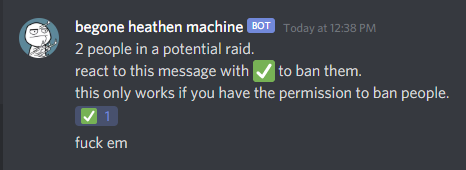
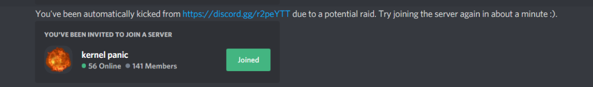

# automatically detects and prevents discord raids
if x people join in y amount of time, a raid is detected.
people get kicked and get a private message until the cooldown expires.
you also get the option to ban the accounts involved in the potential raid at the end.

